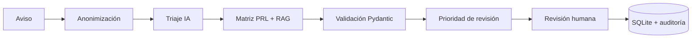

<div align="center">

<h1>🦺 IAviso Seguro</h1>

<p><strong>Triaje asistido y revisión humana de avisos sintéticos de riesgos laborales</strong></p>

<p>
  <a href="https://github.com/elenacarino-max/IAviso_Seguro/actions/workflows/ci.yml"></a>
  
  
  
</p>

<h3><a href="https://1drv.ms/v/c/7ce3bdc7de7f9f99/IQAT8H_tGd7mQ5GWtXrtEZoTAf70W8wb5y7Uri24AzHk4ss?e=H7IZKQ">▶ Ver vídeo demo de la aplicación</a></h3>

<p>
  <a href="#inicio-rápido">Inicio rápido</a> ·
  <a href="#qué-ofrece">Funcionalidades</a> ·
  <a href="#documentación">Documentación</a> ·
  <a href="#cómo-funciona">Arquitectura</a>
</p>

</div>

> [!IMPORTANT]
> Proyecto académico y demostrativo basado exclusivamente en datos sintéticos.
> No sustituye una evaluación profesional ni el protocolo de emergencias y no
> está preparado para procesar avisos reales.

## Qué es

IAviso Seguro transforma una observación libre sobre un posible riesgo laboral
en una propuesta estructurada de **categoría, urgencia, resumen y departamento**.
La propuesta se apoya en una matriz PRL didáctica y en evidencia documental, pero
la decisión final siempre corresponde a una persona técnica.

## Qué ofrece

| Área | Capacidades principales |
| --- | --- |
| **Triaje** | Ollama local o Gemini externo bajo el mismo contrato validado. |
| **Revisión humana** | Aprobación, corrección o rechazo con control de versión y auditoría. |
| **Evidencia** | Regla de matriz y fuentes RAG realmente consultadas, sin referencias inventadas por el modelo. |
| **Privacidad** | Anonimización local de correos, teléfonos españoles, DNI/NIE e IBAN antes de persistir o consultar modelos. |
| **Priorización** | Incertidumbre técnica y prioridad de revisión calculadas mediante reglas deterministas. |
| **Recurrencia** | Detección opcional de avisos semánticamente similares mediante embeddings locales. |
| **Evaluación** | Comparación paralela de proveedores, benchmark sintético y métricas históricas. |
| **Análisis preventivo** | Agregados por zonas basados únicamente en clasificaciones confirmadas por una persona. |

La SPA incluye alta de avisos, bandeja profesional, registro de decisiones,
matriz de referencia, panel de métricas, comparación entre proveedores y
benchmark. Las propuestas, revisiones, evidencias y métricas se conservan en
SQLite.

## Cómo funciona



La interfaz nunca accede directamente a los modelos ni a la base de datos.
FastAPI valida los contratos, controla la evidencia, coordina Ollama o Gemini y
persiste por separado la propuesta original y la decisión humana.

### Stack

- **Frontend principal:** React, TypeScript y Vite.
- **Backend:** Python, FastAPI y Pydantic.
- **Modelos:** Ollama local y Gemini mediante adaptadores independientes.
- **Persistencia:** SQLite.
- **Calidad:** Pytest, Vitest y GitHub Actions.
- **Respaldo académico:** dashboard Streamlit.

## Inicio rápido

### Windows

Con Python, Node.js y Ollama instalados, ejecuta desde la raíz:

```powershell
.\start.ps1
```

También puedes abrir `start.bat`. El lanzador prepara el entorno, inicia los
servicios, selecciona puertos libres y abre la aplicación. Detén sus procesos
con `Ctrl+C`.

Para instalación manual, configuración de modelos, Docker y resolución de
arranque, consulta la **[guía de puesta en marcha](docs/PUESTA_EN_MARCHA.md)**.

### Verificación rápida

```powershell
python -m pytest -q
cd frontend-react
npm test
npm run build
```

## Documentación

| Documento | Contenido |
| --- | --- |
| **[Vídeo demo](https://1drv.ms/v/c/7ce3bdc7de7f9f99/IQAT8H_tGd7mQ5GWtXrtEZoTAf70W8wb5y7Uri24AzHk4ss?e=H7IZKQ)** | Recorrido visual por la aplicación. |
| [Guía funcional](docs/GUIA_FUNCIONAL.md) | Perfiles, pantallas, recorridos, privacidad, recurrencia y criterios de revisión. |
| [Puesta en marcha](docs/PUESTA_EN_MARCHA.md) | Instalación, variables de entorno, modelos, Docker, pruebas y demos sintéticas. |
| [Arquitectura e integraciones](docs/ARQUITECTURA_E_INTEGRACIONES.md) | Flujo de datos, servicios, persistencia, matriz, RAG y límites técnicos. |
| [API FastAPI](backend/app/api/README.md) | Endpoints, filtros, contratos HTTP y códigos de error. |
| [Frontend React](frontend-react/README.md) | Desarrollo de la SPA, validación y relación con el backend. |
| [Datos](data/README.md) | Datasets sintéticos, corpus preventivo y almacenamiento local. |
| [Pruebas unitarias](tests/unit/README.md) · [integración](tests/integration/README.md) | Alcance y estrategia de las pruebas automatizadas. |

## Estructura del proyecto

```text
IAviso_Seguro/
├── backend/          API, contratos, servicios, proveedores y persistencia
├── frontend-react/   SPA principal en React y TypeScript
├── frontend/         Dashboard Streamlit de respaldo
├── config/           Matriz PRL didáctica y versionada
├── data/             Corpus, evaluación y almacenamiento local
├── docs/             Guías funcionales, técnicas y de operación
├── scripts/          Demos sintéticas y utilidades
└── tests/            Pruebas unitarias, integración y fixtures
```

Cada área con decisiones propias dispone de documentación cercana al código;
por ejemplo, [proveedores](backend/app/providers/README.md),
[servicios](backend/app/services/README.md),
[contratos](backend/app/schemas/README.md) y
[persistencia](backend/app/repositories/README.md).

## Principios y límites

- Todo resultado de IA es una propuesta pendiente de validación humana.
- Los textos, matrices, corpus y datasets incluidos son sintéticos y didácticos.
- La urgencia preventiva, la incertidumbre técnica y la prioridad de revisión
  son conceptos distintos.
- La anonimización del MVP reduce exposiciones accidentales, pero no detecta
  nombres propios ni constituye una solución legal completa.
- La similitud entre avisos no es una probabilidad ni confirma que describan el
  mismo incidente.
- Ante un peligro inmediato debe aplicarse el protocolo de emergencias del
  centro, no esta aplicación.

---

<div align="center">

<p>
  <strong><a href="https://1drv.ms/v/c/7ce3bdc7de7f9f99/IQAT8H_tGd7mQ5GWtXrtEZoTAf70W8wb5y7Uri24AzHk4ss?e=H7IZKQ">▶ Ver la demo</a></strong> ·
  <strong><a href="docs/GUIA_FUNCIONAL.md">Consultar la guía funcional</a></strong> ·
  <strong><a href="docs/PUESTA_EN_MARCHA.md">Ponerlo en marcha</a></strong>
</p>

</div>
